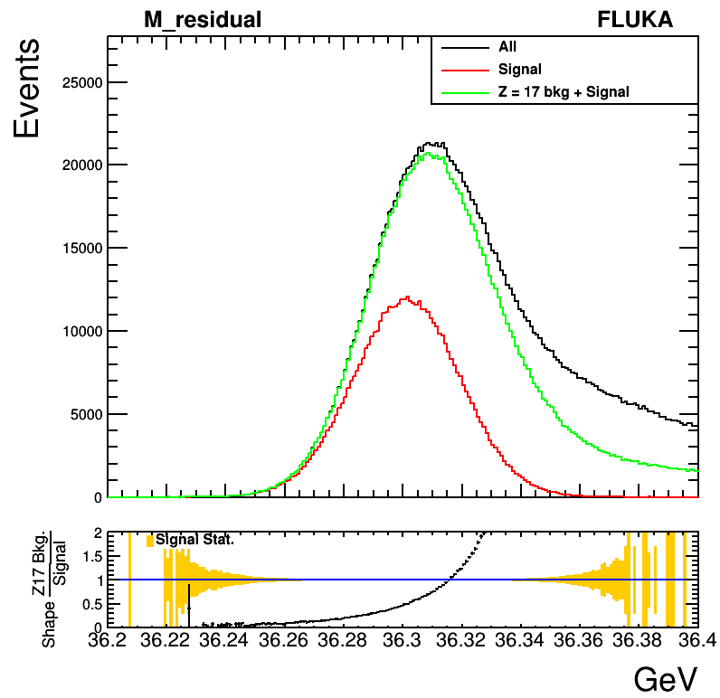
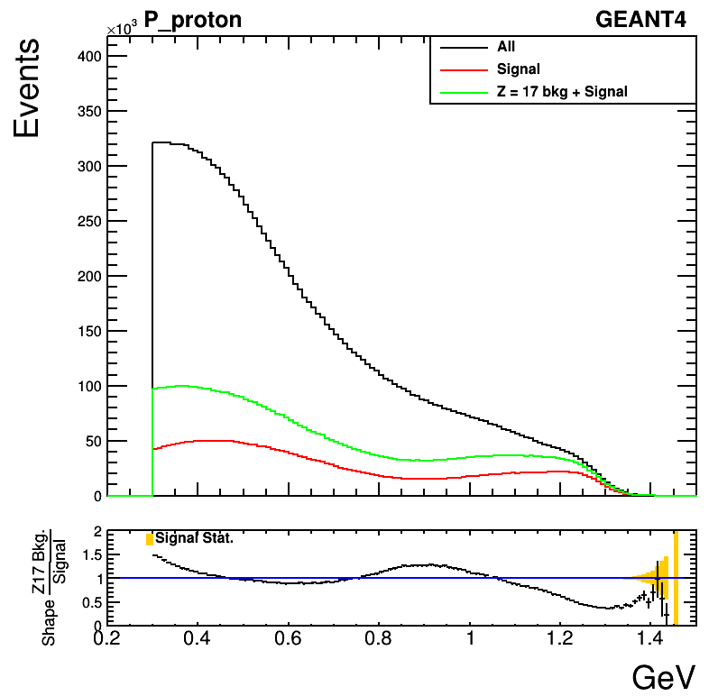
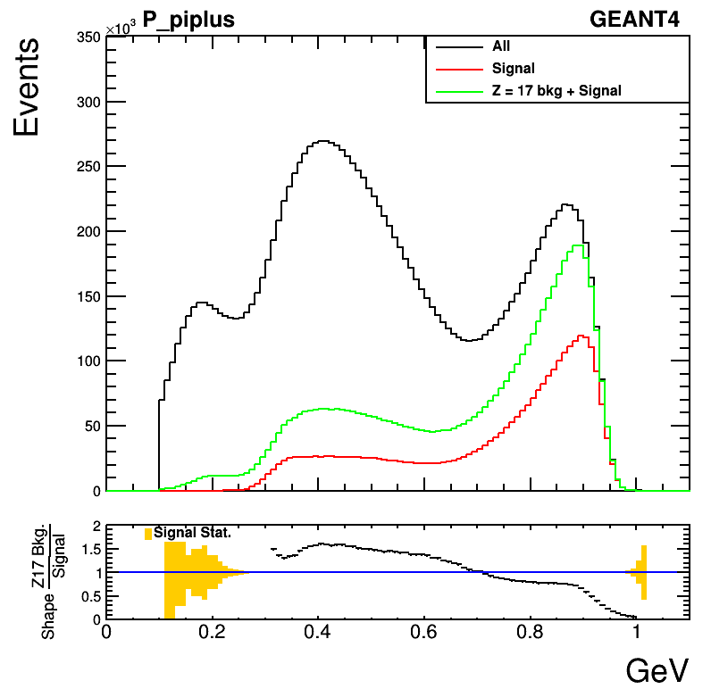
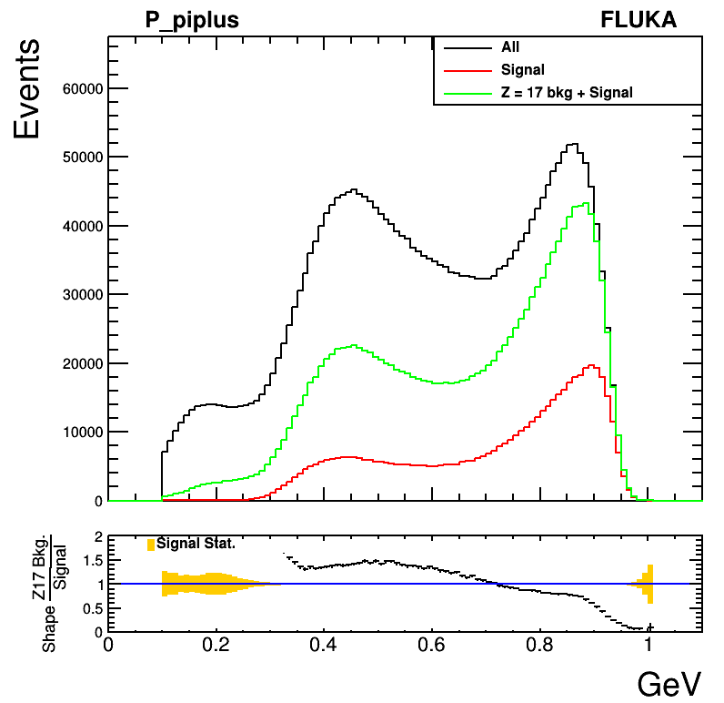
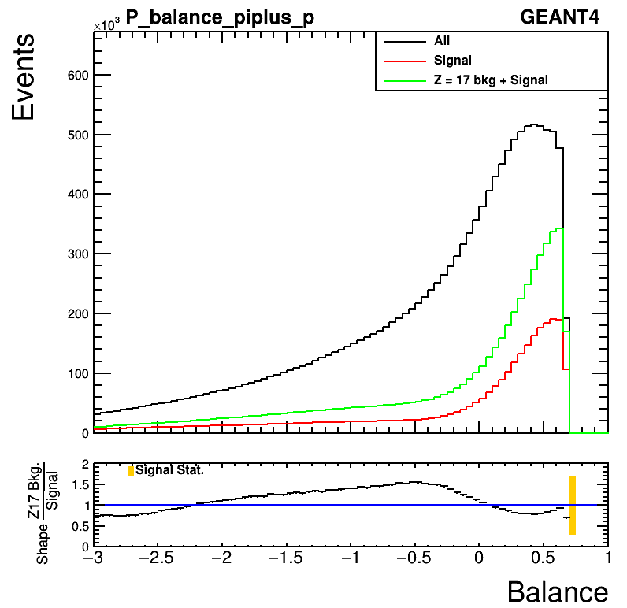
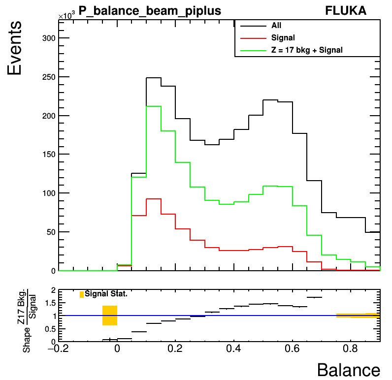
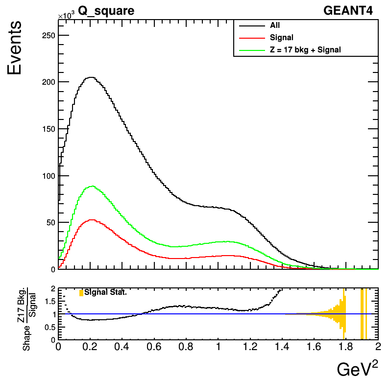
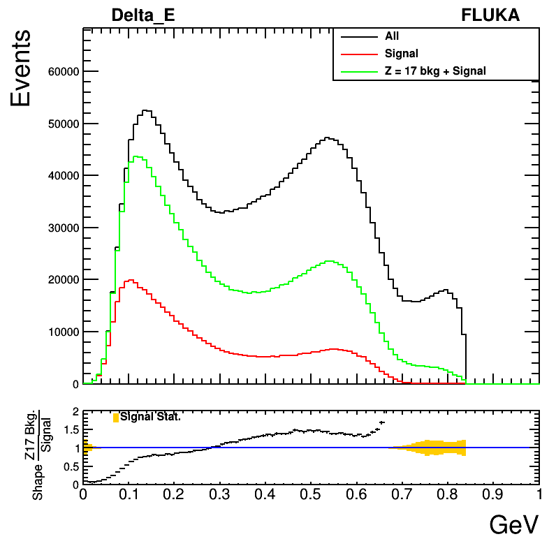

## Plots (residual mass < 36.310 GeV)

All plots are drawn after applying momentum and angular smearing.
At second pad of each plot, ratio between absolute shapes of signal and Z = 17 background is presented.

### Z and A of residual nuclei for FLUKA events

Since particle ID is 9999 for all nuclei for FLUKA samples, there should be a method to assign Z and A for residual nuclei to select signal and Z = 17 background events.
Unfortunately, current FLUKA samples do not have 4-vectors of residual nuclei with mass close to Ar.

The figure shows mass of particles with particle ID greater than 9000 in GeV unit at SR1 without mX' cut.
There is no nuclear with mass greater than 34 GeV. Therefore, we need to find out Z and A of residual nuclei using information coming from other secondary particles.

After applying mX < 36.310 GeV cut, we observe that most of the events do not have additional nuclear (particle ID > 9000) as secondary particle (bellow figure).

So, we can find out Z and A of residual nuclei using total electric charge and baryon number of other secondary particles (mostly pi+, pi-, proton, neutron).

${Z}_{res} = {Z}_{Ar} (= 18) - N({\pi}^{+}) + 1 (beam~is~{\pi}^{+}) + N({\pi}^{-}) - N(proton)$  
${A}_{res} = {A}_{Ar} (= 40) - N(proton) - N(neutron)$   

In addition, we need to consider about 1% of signal events which have one additional nuclear as a secondary particle.
(Events with at least two additional secondary particles are about 0.01% compared to total events at SR1 with mX' < 36.310 GeV cut. So, they are negligible.)

The above figure shows that most of the additional nuclei are ${}^{4}$He. It is about 1% compared to total events at SR1 with mX' < 36.310 GeV cut,
while other nuclei make contributions of about 0.05%. Therefore, we select events with exactly one additional nuclear and check if its mass is in the 10 MeV window from ${}^{4}$He mass.
If it is true, we apply additional correction to ${Z}_{res}$ and ${A}_{res}$ as

${Z}_{res} = {Z}_{res}  - 2$  
${A}_{res} = {A}_{Ar} - 4$  

### Residual mass

  

We can check that cut on residual mass to be smaller than 36310 MeV is applied correctly.

### Momentum

 

 

We see that shapes of signal and Z = 17 backgroud events are different at and nearby the peak.

### Momentum balance

 

 

 

Momentum balance distributions show more similar shapes between signal and Z = 17 background than momentum plots.

### Q^2

 

${Q}^{2}$ distributions show that shape between signal and Z = 17 are almost same where Q^2 is in [0.15 ${GeV}^{2}$, 1 ${GeV}^{2}$] range.
It could be used for Z = 17 background estimation.

### Energy transfer

 

These figures show E(beam) - E(piplus), the energy transfer during scattering. We observe similar tendency which is observed in ${Q}^{2}$ plots. 