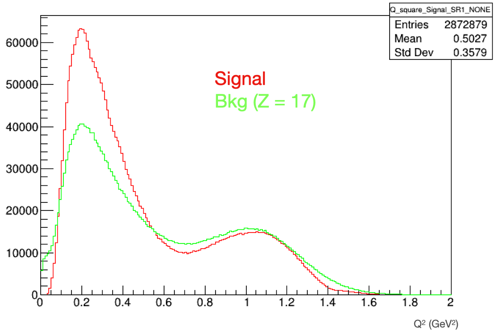
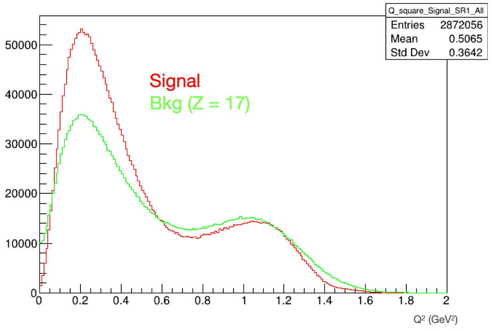

# Definition of Q_square

We check the Lorentz invariant ${Q}^{2}$ to study the scattering
```
Particle q_4vec = beam - piplus.at(1);
Q_square = (-pow(q_4vec.E(), 2) + pow(q_4vec.P(), 2))
```

## Q squre distributions

${Q}^{2}$ distribution of signal and Z = 17 background without smearing.



${Q}^{2}$ distribution of signal and Z = 17 background after smearing.



We observe a bit wider shape after applying smearing.  
Signal and Z = 17 background events show a bit different shapes,  
but ${Q}^{2}$ is not a good discriminating variable.

There are two peaks, one at ~0.2 ${GeV}^{2}$ and the other at ~1.1 ${GeV}^{2}$.  
It means that there are two different physics.  
We would like to understand it.


###  ${Q}^{2}$ vs Momentum balance

We can think about momentum balance between outgoing ${\pi}^{+}$ and proton.  
At the first peak of ${Q}^{2}$ distribution, the outoing ${\pi}^{+}$ has larger momentum compared to the outgoing proton  
because it is quasi-elastic (QE) scattering with small momentum transfer.  
At the second peak of ${Q}^{2}$ distribution, the outoing ${\pi}^{+}$ would have comparable momentum with the outgoing proton.  
However, momentum balance would prefer negative value due to different momentum cuts applied to ${\pi}^{+}$ (> 0.1 GeV) and proton (> 0.3 GeV).