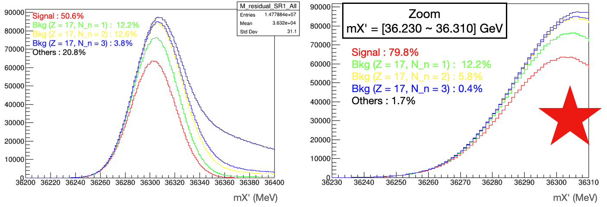
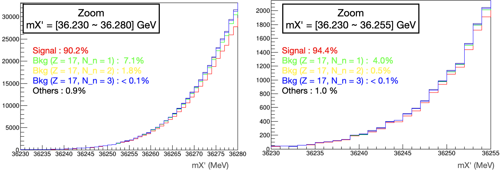

# Definition of residual mass

We reconstruct 4-vector of residual nuclei using beam, outgoing ${\pi}^{+}$ and proton.  
```
${X}^{'}$ = beam - Ar_target(at rest) - ${\pi}^{+}$ - proton
```

## Residual mass distribution before smearing


We observe Z = 17 background (Cl with different atomic mass) at just above signal events.  
So, we can expect that overlap between signal and background after smearing will be dominated by Z = 17 background.

## Residual mass distribution after smearing


We observe exactly what we expected

### How many additional neutrons?

There should be additional neutrons for events in Z = 17 background.  
We want to check,  

*   How many neutrons at truth level after scattering?
*   Which cut value on residual mass will give good signal purity?


