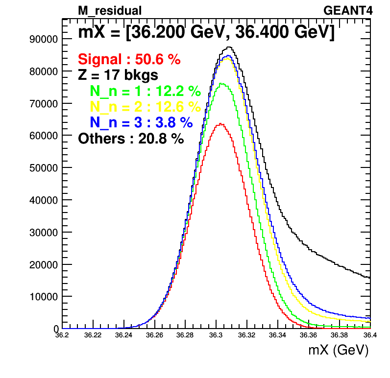
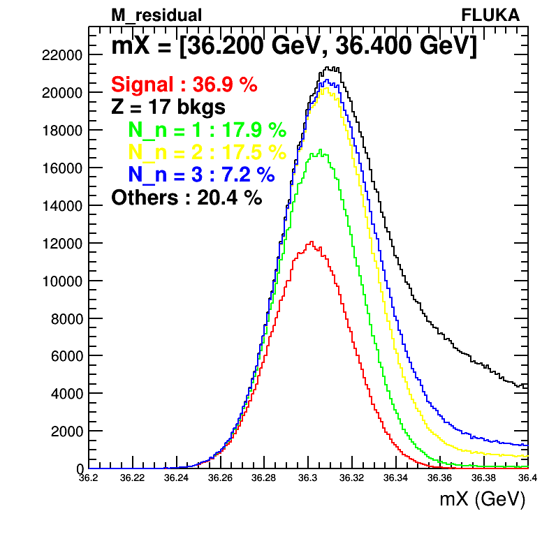
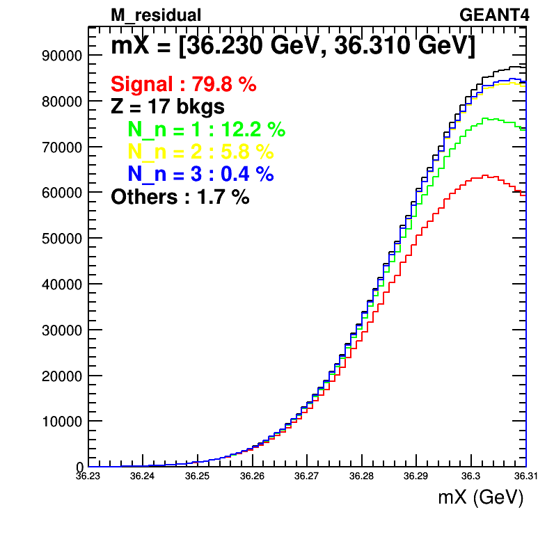
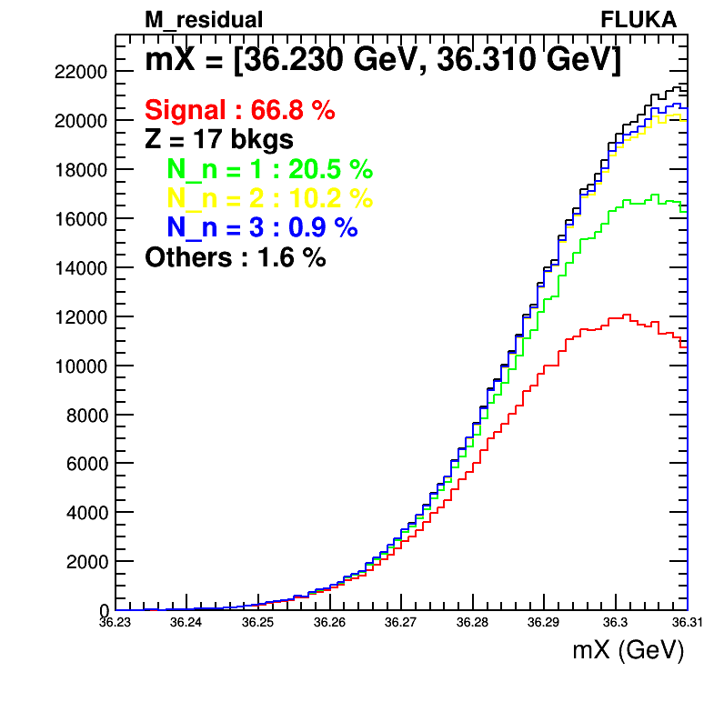
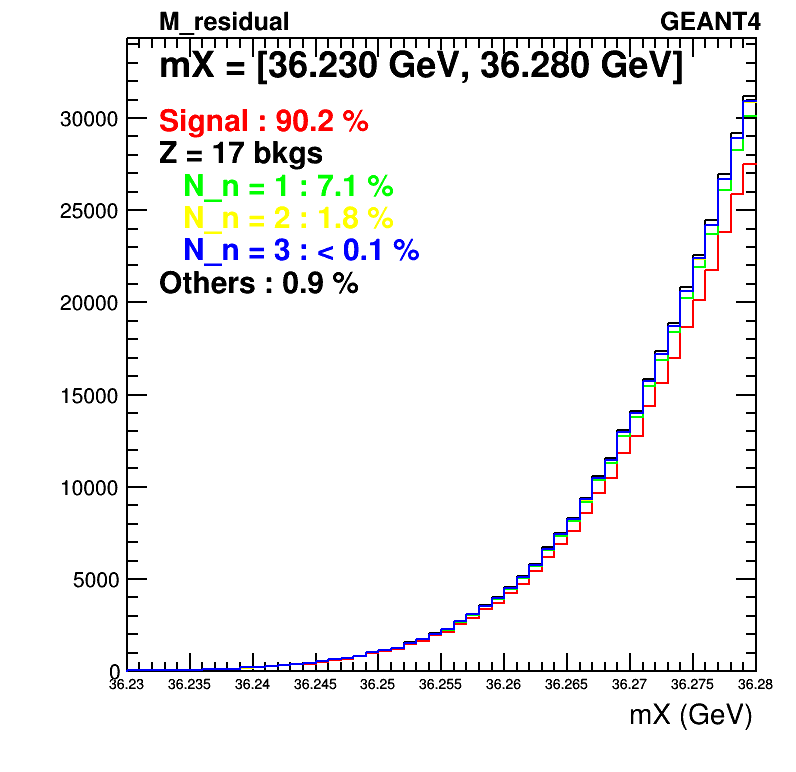
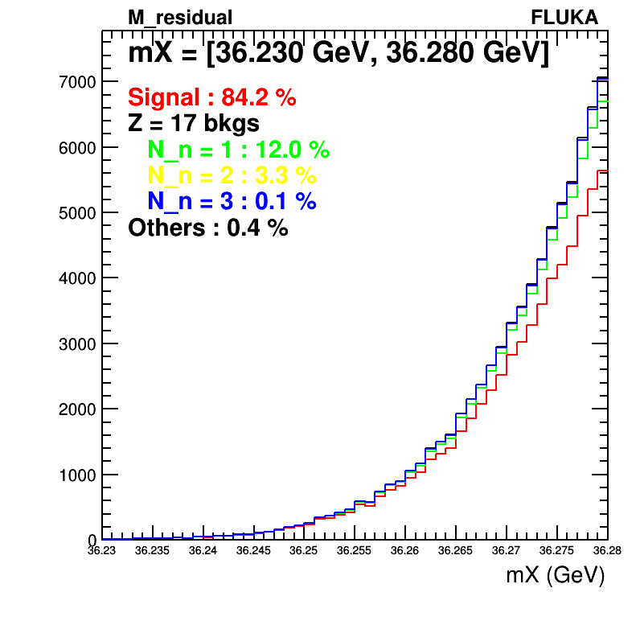
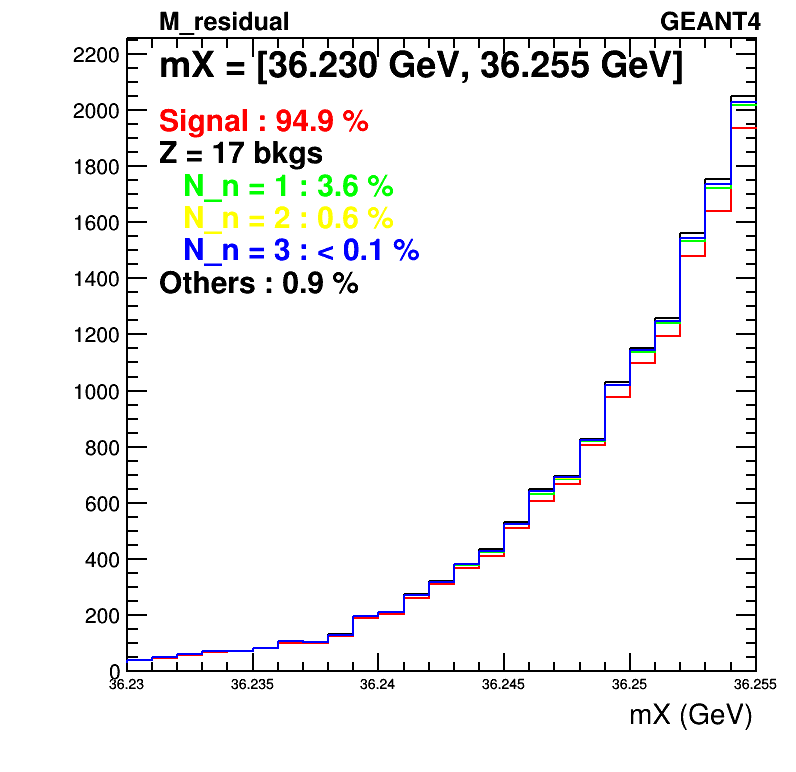

# Definition of residual mass

We reconstruct 4-vector of residual nuclei using beam, outgoing ${\pi}^{+}$ and proton.  
```
${X}^{'}$ = beam - Ar_target(at rest) - ${\pi}^{+}$ - proton
```

## Residual mass distribution before smearing


We observe Z = 17 background (Cl with different atomic mass) at just above signal events.  
So, we can expect that overlap between signal and background after smearing will be dominated by Z = 17 background.

## Residual mass distribution after smearing


We observe exactly what we expected

### How many additional neutrons?

There should be additional neutrons for events in Z = 17 background.  
We want to check,  

*   How many neutrons at truth level after scattering?
*   Which cut value on residual mass will give good signal purity?

 
 
 
 

We observed that GEANT4 shows more signal events.
Both generators show that background events are dominated by events coming from Z = 17 background.

### Neutron momentum

To understand possibility of Z = 17 background rejection using neutron tagging, we need to check momentum of neutrons.

*   Plots before applying mX cut.

 
 
 

Most of the neutrons have momentum smaller than 150 MeV.

*   Plost after applying mX < 36.1 GeV cut.

 
 
 

Long tails are removed.